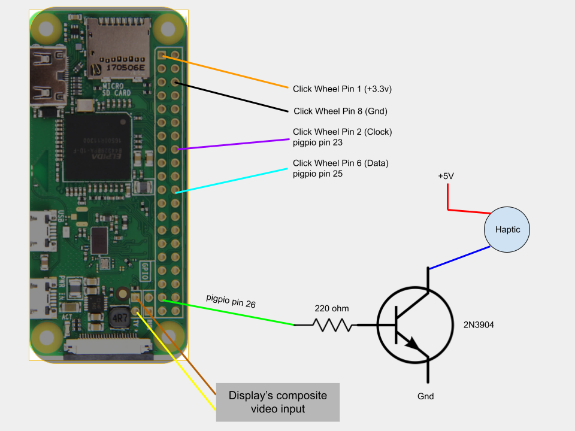

# sPot

This code is meant to accompany [this project](https://hackaday.io/project/177034-spot-spotify-in-a-4th-gen-ipod-2004) in which a Spotify client is built into an iPod "Classic" from 2004. Everything is meant to run on a Raspberry Pi Zero W.

Since we are using the lite version of raspbian, some extra packages need to be installed:

# Instructions

1. Install updates 

```
sudo apt-get update 
sudo apt-get upgrade
```
2. Install Required Packages.

Installation for python3-pip, raspotify, python3-tk, openbox
```

sudo apt install python-setuptools python3-setuptools

sudo apt install python3-pip

sudo curl -sL https://dtcooper.github.io/raspotify/install.sh | sh

sudo apt-get install python3-tk 

sudo apt-get install redis-server

sudo apt-get install openbox

sudo apt install xorg

sudo apt-get install lightdm

sudo apt-get install x11-xserver-utils

```
3. Install Dependencies

```
pip3 install -r requirements.txt
```

4. Install pi-btaudio
```
git clone https://github.com/bablokb/pi-btaudio.git
cd pi-btaudio
sudo tools/install
```
5. Install PiGPIO
```
wget https://github.com/joan2937/pigpio/archive/master.zip
unzip master.zip
cd pigpio-master
make
sudo make install
```

6. Setup Spotify API

First Create an App at https://developer.spotify.com/dashboard/applications/
```
https://accounts.spotify.com/authorize?client_id=XXXXXXXXXXXXXXXXXXXXXXXXXXXXX&response_type=code&redirect_uri=http%3A%2F%2F127.0.0.1&scope=user-read-playback-state%20user-modify-playback-state%20user-read-currently-playing%20	app-remote-control%20streaming%20playlist-modify-public%20playlist-modify-private%20playlist-read-private%20playlist-read-collaborative
```


7. raspi-config

` sudo raspi-config`

_Console Autologin_

_Display Option -> Screen Blanking -> Off_ if you want to avoid the screen turning black after a few seconds.


8. bash_profile

In *.bash_profile* added the following (if the file is not htere, you must create it)

```
#!/bin/bash

[[ -z $DISPLAY && $XDG_VTNR -eq 1 ]] && startx -- -nocursor

# Disable any form of screen saver / screen blanking / power management

xset s off

xset s noblank
```

9. Configure xinitrc

`sudo nano /etc/X11/xinit/xinitrc`


Inside, make sure the following is there:
```
#!/bin/sh

# /etc/X11/xinit/xinitrc

# global xinitrc file, used by all X sessions started by xinit (startx)

# invoke global X session script

#. /etc/X11/Xsession

exec openbox-session #-> This is the one that launches Openbox ;)
```
10. Run "spotifypod.py" with autostart

`sudo nano /etc/xdg/openbox/autostart`


and add the following command to launch spotifypod.py:

```
cd /home/pi/fork/retro-ipod-spotify-client/frontend/

sudo -H -u pi python3 spotifypod.py &

sudo /home/pi/fork/retro-ipod-spotify-client/clickwheel/click &
```

_Make sure that the paths are ok with your setup!!_

in ` sudo nano /etc/xdg/openbox/environment` all the variables needed to run spotifypod.py are set( SPOTIPY_CLIENT_ID, SPOTIPY_CLIENT_SECRET,SPOTIPY_REDIRECT_URI)

```
export SPOTIPY_CLIENT_ID='your_SPOTIPY_CLIENT_ID'

export SPOTIPY_CLIENT_SECRET='your_SPOTIPY_CLIENT_SECRET'

export SPOTIPY_REDIRECT_URI='your_SPOTIPY_REDIRECT_URI'
```

11. Synchronizing Spotify data!
Last but not least, if you want to make sure all your playlists artists, etc are synchronized every time you turn on your Spotypod, you can simply modify the script view_model.py with the following at line 16:

`#spotify_manager.refresh_devices()`

`spotify_manager.refresh_data()`


instead of calling refresh_device, you can execute refresh_data. This will sync all your data and then will eceute refresh.devices. This will make the boot up way slower! but it will synchronize every single time you switch on :). 
If you dont run at least once `refresh_data()` no playlist, artist or anything related with your account will be displayed!

12. Configure Raspotify

`sudo nano /etc/default/raspotify`


Uncomment and fill the following line:

`OPTIONS="--username <USERNAME> --password <PASSWORD>"`


And maybe you want also to consider the following:

```
# The displayed device type in Spotify clients. 

# Can be "unknown", "computer", "tablet", "smartphone", "speaker", "tv",

# "avr" (Audio/Video Receiver), "stb" (Set-Top Box), and "audiodongle".

DEVICE_TYPE="smartphone"
```

# Wiring

Here is the wiring of the hardware, as of revision 1. Note that the pin numbers correlate to those referenced in [click.c](./clickwheel/click.c)

